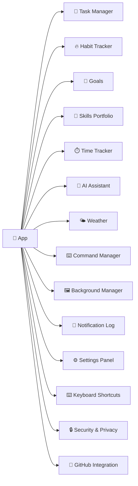

# Nexus Documentation Graph

Minimal Obsidian-style link graph connecting all feature notes. Open in Obsidian → Graph View to visualize.

---

## Core Hub
- [[Nexos Productivity App]] — central feature map & navigation
- [[README]] — this index

---

## Productivity Modules

---

## Direct Links (for Graph View)

### Task Ecosystem
- [[Task Manager]] — list, kanban, due dates, reminders, Vim nav
- [[Kanban Board]] — drag-drop columns (Not Started / In Progress / Completed)
- [[Notification Log]] — due, overdue, completed, AI replies, reminders
- [[GitHub Integration]] — issues → tasks, PAT encrypted
- [[AI Assistant]] — creates/completes tasks via `<action>` blocks
- [[Command Manager]] — snippets → tasks via AI

### Habit & Growth Ecosystem
- [[Habit Tracker]] — yearly heatmap, streaks, edit-past, Vim nav
- [[GitHub Integration]] — commit heatmap alongside habits
- [[Skills Portfolio]] — XP/levels, proof links, general + per-skill XP
- [[Goals]] — derived progress from linked tasks
- [[Time Tracker]] — live timer + manual entry, links to tasks/goals
- [[Notification Log]] — streak milestones (optional)

### AI Assistant Ecosystem
- [[AI Assistant]] — chat, context-aware, action execution, prompt library
- [[Task Manager]] — reads tasks, creates/completes via actions
- [[Weather Dashboard]] — pulls weather data for queries
- [[Habit Tracker]] — can suggest habit tips
- [[Notification Log]] — AI replies generate notifications
- [[Command Manager]] — may suggest CLI commands
- [[Command Palette]] — inserts saved prompts

### Weather Ecosystem
- [[Weather Dashboard]] — current conditions, search, unit toggle, AI suggestion
- [[Weekly Forecast]] — 7-day outlook, same location/unit
- [[Weather Card]] — reusable metric component (humidity, wind, etc.)
- [[Background Manager]] — condition can influence background
- [[AI Assistant]] — references weather data
- [[Settings Panel]] — location preference

### UI & Settings Ecosystem
- [[Settings Panel]] — profile, notifications, GitHub, reset data
- [[Background Manager]] — custom images, opacity, blur, B/W, parallax
- [[Keyboard Shortcuts]] — global + vim-style per module
- [[Security & Privacy]] — local-first, AES-256, no backend collection
- [[Command Palette]] — Cmd+K global actions, navigation, theme switching
- [[Onboarding Flow]] — guided intro (name, location, notifications)

---

## Data Flow Summary

| Store | Keys | Sync |
|-------|------|------|
| `localStorage` | `tasks`, `habits`, `habit-entries`, `commands`, `settings`, `background`, `chat-history` | Yjs → IndexedDB → WebRTC P2P |
| `IndexedDB` (Yjs) | CRDT maps for tasks, skills, goals, time-entries, growth-profile | WebRTC signaling via backend |
| Encrypted | `github_token` | AES-256 client-side |

---

## Quick Navigation (wiki-links)

**Pages**
- [[Nexos Productivity App]]
- [[Task Manager]] | [[Kanban Board]]
- [[Habit Tracker]] | [[GitHub Integration]]
- [[AI Assistant]] | [[Command Palette]]
- [[Weather Dashboard]] | [[Weekly Forecast]] | [[Weather Card]]
- [[Command Manager]]
- [[Background Manager]]
- [[Notification Log]]
- [[Settings Panel]]
- [[Keyboard Shortcuts]]
- [[Security & Privacy]]
- [[Skills Portfolio]] (implied)
- [[Goals]] (implied)
- [[Time Tracker]] (implied)

**Technical**
- [[Architecture Overview]] (optional)
- [[API Endpoints]]
- [[Data Models]]

---

## Tags for Filtering
#task #habit #ai #weather #command #background #notification #settings #keyboard #security #github #skill #goal #time #sync #crdt #p2p #local-first #encryption #pwa

---

*Generated — edit freely. Graph View in Obsidian shows live connections.*